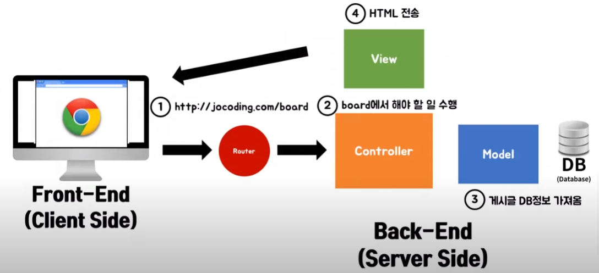

Section3 Database (re)

DB와 CRUD 가능한 페이지 제작 

CRUD (Create, Read, Update, Delete)

---

git config --global core.autocrlf true

---

백엔드 MVC 작동 방식

출처 : [조코딩 유튜브](https://youtu.be/2CHkds265N8)

 1. Front-End (브라우저에서 http://~~/board 입력)
 2. Router (board 를 읽어 Controller 에 신호)
 3. Controller (Model을 통해 DB를 불러와서 정보를 View 를 통해서 화면으로 출력)

=> 사용 DB : 관계형 DB (RDB) : like 엑셀

---

과거 프로젝트에서 DBever 를 이용해 서버 연결을 시도 했으나 실패.  
Mongo DB를 사용해 웹앱에 CRUD를 구현하려 함 (NoSQL)

---

필요 지식

Node.js  
NoSQL Database (MongoDB)  
DB에 CRUD  
서버제작 (API)  
+서버 배포, npm, bootstrap 등..

---
개념 정리 (쉽게 설명)

https://www.youtube.com/watch?v=NoLV5iP5FNY

1-1. SERVER
 - <요청>을 받으면 요청한 내용을 보내주는 프로그램
 - 요구를 하면 가져다 줌 (식당 알바생)
 - 네이버 서버에 : "웹툰 주문" 하면 페이지를 가져다 줌

1-2. 요청 (4개)
 (1) 일기 (GET)     - 뭔가를 읽고 싶을 때  
 (2) 쓰기 (POST)    - 뭔가를 생성할 때  
 (3) 수정 (PUT)     - 뭔가 수정할 때  
 (4) 삭제 (DELETE)  - 뭔가 삭제할 때

---
https://www.youtube.com/watch?v=pTm5E3jcOeY

2-1. NodeJS

JavaScript : HTML 에 종속된 언어 (HTML 조작 언어)  
HTML : 웹페이지를 만들기 위한 언어 (정적임 - 글 그림)  
    - 이때, Java를 활용하면 HTML이 조작 가능함 (다이네믹)  

JS 해석은 브라우저 담당  
 - 해석엔진 (크롬 - V8, 익스플로러 - Chakra , 파이어폭스 - SpiderMonkey)  
 - 크롬이 빠른 이유 (JS 해석엔진이 해석을 잘해서 빠름)

-> 크롬에서 V8에 기능을 추가해 출시 : Node.js (자바를 브라우저 외 다른 환경에서 활용 가능)

---
2-2. Node.js 특징

일반언어 서버 : 요청이 많아 지면, 다음 요청은 기다려야 함

Node.js 서버 : 일단 요청부터 다 받고, 처리 속도가 빠른 것 부터 결과를 보내 줌 (None Blocking IO)  
    -> 따라서 sns, 채팅 등 많은 양의 요청이 와도 속도를 빠르게 할 수 있음   
    -> 코드가 짧고 쉬움 (빠른 개발 가능 - 프로토 타입 가능)  
    -> 보통 웹서비스 많이 사용 (ex.이미지 처리 서버에는 별로.. 라이브러리 별로 없음)  

---

Node.js 설치 및 생성

 - express 라이브러리 설치  
    -> npm init ( package.json 에 라이브러리 기록이 담김 )  
    -> 엔터.엔터... entry point: (index.js) server.js 로 설정 후 엔터..  
    -> package.json 이 생성 됨  

    -> npm install express ( package.json 에 "express": "^4.17.1" 기록 )  
    -> node_modules 생성됨  
    -> (만약 이 과정에서 에러시 - 구글에 yarn 설치후 사용 (npm 대신 yarn 사용))  

---
https://www.youtube.com/watch?v=HeOh-go-fYY

파일 만들기 : server.js (위에서 설정 시 사용하겠다고 한 파일 명 사용)

server.js 에 코드 작성

---
---
---
(다른 강의)  
vs code 단축키들

https://www.youtube.com/watch?v=9h8uXIsOimc&list=PLHGvDasahwZMko2OayS24NEzWYf3sMq2w&ab_channel=DannyTWLC

extention - Material Icon Theme , Bracket Pair Colorizer  
(드래그 - alt + shift + 방향키 아래 : 드래그 부분 바로 복사)

단어 더블클릭 - ctrl + d (다음 같은 단어 선택) -> 여러개 선택 후 동시 변경 가능  
단어 더블클릭 - ctrl + u (윗 단어 선택)

alt + 더블클릭 : 단어 여러개 선택 후 동시에 변경 가능

---

Node.js 실행

npm : node package manger 의 준말

npm init : npm 을 시작한다는 정보

app.js 만들기  
add.js 만들기
mult.js 만들기
stat.js 만들기

node app.js 실행

---

https://www.youtube.com/watch?v=VXTJFlCZoT8

add.js 삭제
mult.js 삭제
stat.js 삭제

app.js 에 모든 코드 지우기

https://nodejs.org/api/  에서 코어모듈 확인 (api)

readline : 유저 데이터, 파일 등 데이터 값을 받아 올 때 사용

file system : 파일 경로, 데이터에 관해서 사용

https://www.youtube.com/watch?v=B1jgTcjb4N8&list=PLHGvDasahwZMko2OayS24NEzWYf3sMq2w&index=7

